## 需求概述

图书馆web管理系统主要目的是为读者和图书馆管理员提供图书检索、图书预约、新书查询、超期催收、留言以及公告发布等功能的Web应用程序。致力于为用户提供优秀的使用体验、“以人为本”易操作的功能体验，满足读者和管理员的需求。

对于管理员来说，他们的需求是：（1）易用的公告发布编辑器（2）简单的非批量图书信息编辑功能（3）获取读者的反馈信息（4）查询超期用户、便捷的超期催收功能（5）管理预约登记、导出预约登记表。

对于读者来说，他们的需求是：（1）易用多功能的图书检索功能（2）获取图书馆公告信息、催收通知等（3）反馈建议留言（4）预约图书（5）查看在借图书和预约图书。

## 运行环境

操作系统：Windows XP及以上/MacOS/安卓6.0及以上/IOS7及以上

客户端： Web浏览器

数据库：SQL Server 2019

## 功能需求

 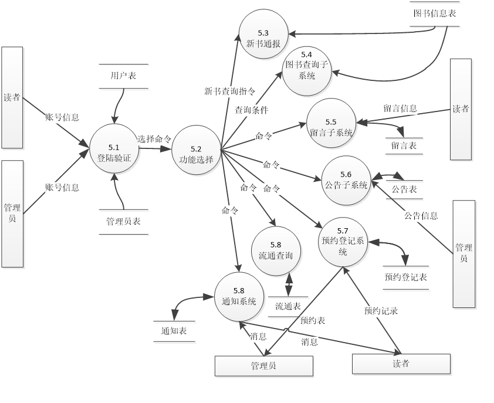

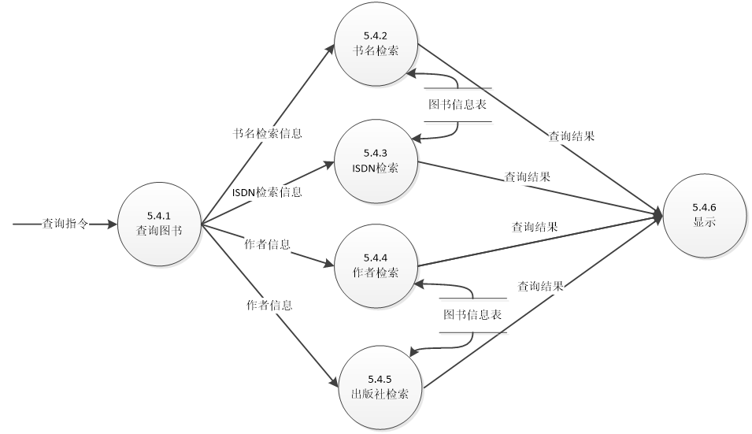

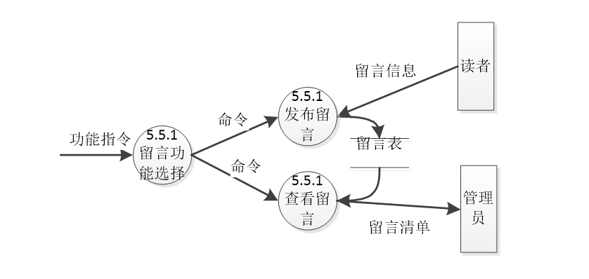

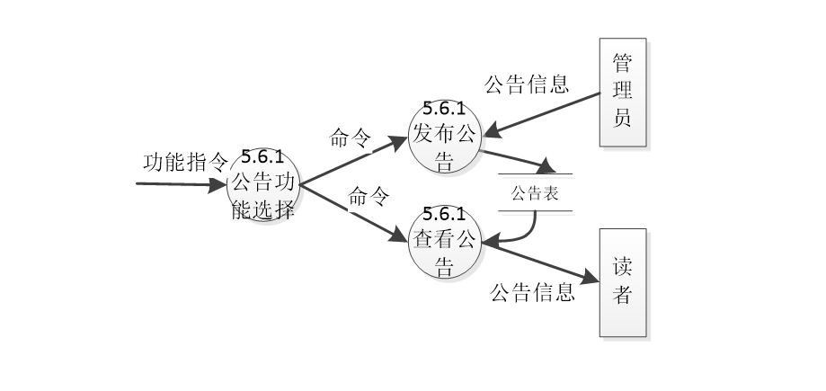

## 软件模块图

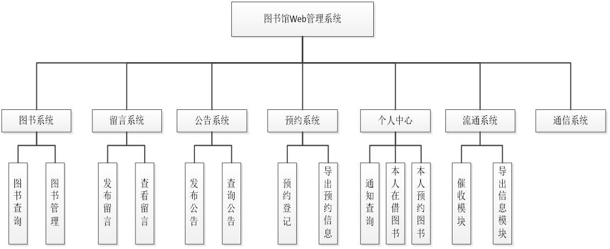

## 界面

### 登录界面

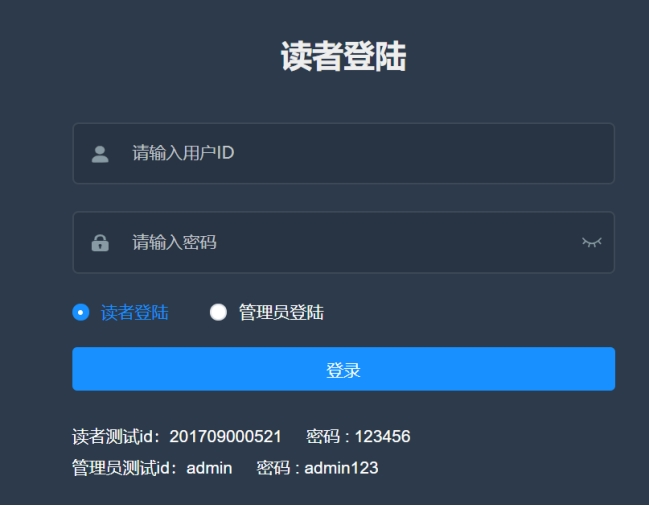

### 路由栏

### 查询图书

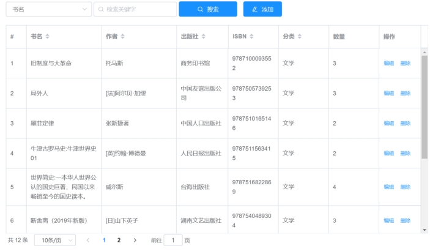

### 预约图书

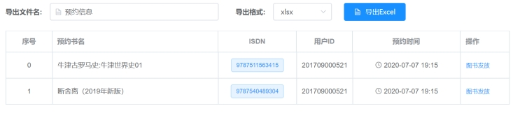

### 借阅历史

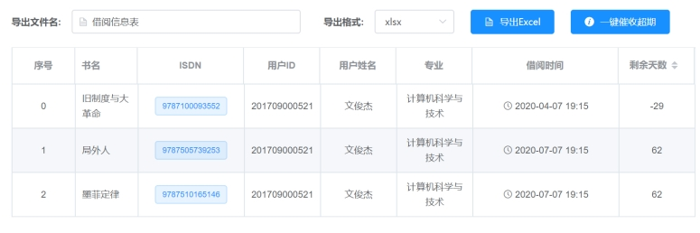

### 公告页

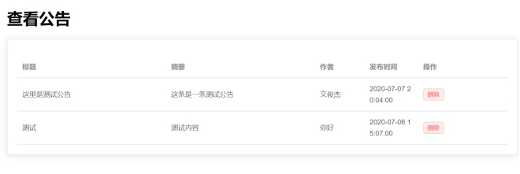

### 发布公告

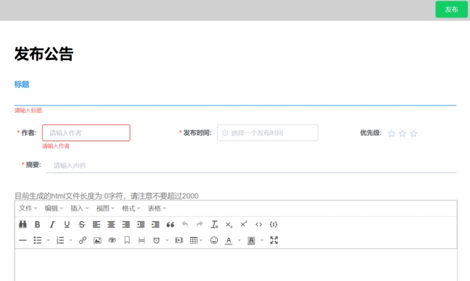

### 个人主页

### 添加图书

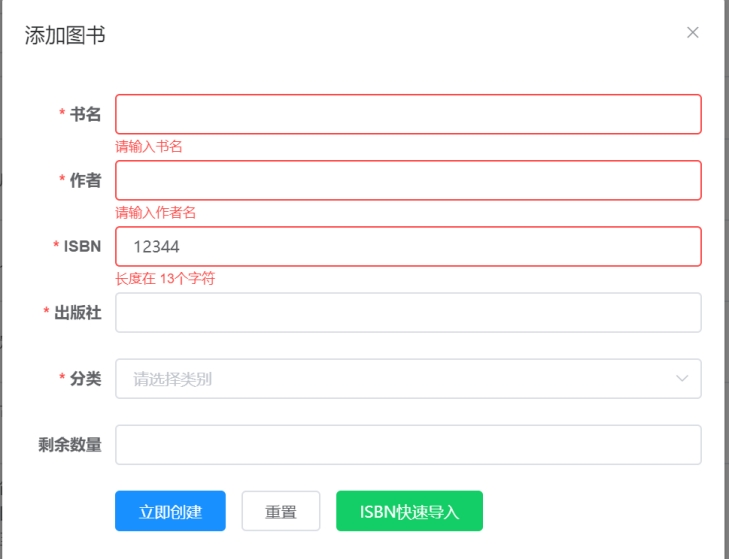

## 数据库

### ER图

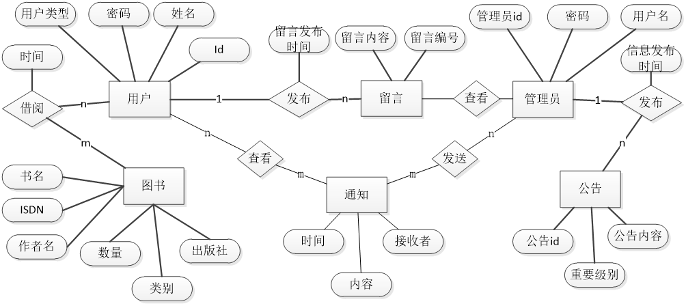

### 数据表设计

图书表：记录了所有图书馆藏书的信息

| 字段名    | 数据类型 | 数据长度 | 描述             | 含义       |
| --------- | -------- | -------- | ---------------- | ---------- |
| bookName  | VARCHAR  | 50       | 不允许为空       | 书名       |
| author    | VARCHAR  | 50       | 不允许为空       | 作者       |
| publisher | VARCHAR  | 50       | 不允许为空       | 出版社     |
| ISDN      | CHAR     | 13       | 不允许为空，主键 | 图书序列码 |
| category  | VARCHAR  | 10       | 不允许为空       | 分类       |
| num       | INT      |          | 不允许为空       | 数量       |
| addtime   | DATATIME |          | 允许为空         | 入库时间   |

用户表：记录了所有用户的信息

| 字段名    | 数据类型 | 数据长度 | 描述            | 含义   |
| --------- | -------- | -------- | --------------- | ------ |
| username  | VARCHAR  | 8        | 不允许为空      | 姓名   |
| major     | VARCHAR  | 10       | 不允许为空      | 专业   |
| class     | CHAR     | 8        | 不允许为空      | 班级   |
| readID    | CHAR     | 12       | 不允许为空,主码 | 读者ID |
| passwords | VARCHAR  | 50       | 不允许为空      | 密码   |

公告表：记录了管理员发布的公告信息

| 字段名        | 数据类型      | 数据长度 | 描述                   | 含义     |
| ------------- | ------------- | -------- | ---------------------- | -------- |
| adminID       | CHAR          | 12       | 不允许为空，主码，外码 | 管理员ID |
| mesID         | INT           |          | 不允许为空，主码，     | 公告编号 |
| content       | VARCHAR       | 5000     | 不允许为空             | 公告内容 |
| important     | SMALLINT      |          | 允许为空               | 重要程度 |
| author        | VARCHAR       | 12       | 不允许为空             | 作者名   |
| title         | VARCHAR       | 60       | 不允许为空             | 公告标题 |
| time          | SMALLDATATIME |          | 不允许为空             | 发布时间 |
| content_short | VARCHAR       | 500      | 不允许为空             | 概要     |

留言表：记录了用户留言内容

| 字段名  | 数据类型      | 数据长度 | 描述                   | 含义     |
| ------- | ------------- | -------- | ---------------------- | -------- |
| readID  | CHAR          | 12       | 不允许为空，主码，外码 | 读者ID   |
| mesID   | INT           |          | 不允许为空，主码，     | 留言编号 |
| content | VARCHAR       | 400      | 不允许为空             | 留言内容 |
| addtime | SMALLDATATIME |          | 允许为空               | 留言时间 |

管理员表：记录了管理员账号密码等信息

| 字段名    | 数据类型 | 数据长度 | 描述            | 含义   |
| --------- | -------- | -------- | --------------- | ------ |
| adminname | VARCHAR  | 20       | 不允许为空      | 姓名   |
| adminID   | VARCHAR  | 12       | 不允许为空,主码 | 管理ID |
| passwords | VARCHAR  | 50       | 不允许为空      | 密码   |

登记表：记录了用于预约图书信息

| 字段名   | 数据类型      | 数据长度 | 描述                   | 含义     |
| -------- | ------------- | -------- | ---------------------- | -------- |
| userid   | VARCHAR       | 12       | 不允许为空，主码，外码 | 用户id   |
| bookisdn | VARCHAR       | 13       | 不允许为空,主码，外码  | 图书isdn |
| opertime | smalldatetime |          | 不允许为空             | 预约时间 |

流通表：记录了用于图书流通信息

| 字段名   | 数据类型      | 数据长度 | 描述                   | 含义     |
| -------- | ------------- | -------- | ---------------------- | -------- |
| userid   | VARCHAR       | 12       | 不允许为空，主码，外码 | 用户id   |
| bookisdn | VARCHAR       | 13       | 不允许为空,主码，外码  | 图书isdn |
| time     | smalldatetime |          | 不允许为空             | 借阅时间 |
| day      | INT           |          | 不允许为空             | 借阅天数 |

通知表：记录了个人通知信息

| 字段名    | 数据类型      | 数据长度 | 描述           | 含义     |
| --------- | ------------- | -------- | -------------- | -------- |
| title     | VARCHAR       | 50       | 不允许为空     | 标题     |
| content   | VARCHAR       | 500      | 不允许为空     | 内容     |
| author    | VARCHAR       | 30       | 不允许为空     | 作者     |
| time      | smalldatetime |          | 不允许为空     | 时间     |
| infoid    | INT           |          | 不允许空，主码 | 序号     |
| sendid    | VARCHAR       | 13       | 不运行空       | 发送者id |
| receiveid | VARCHAR       | 13       | 不允许空，外码 | 接收者id |

## 软件模块描述

### 公告模块

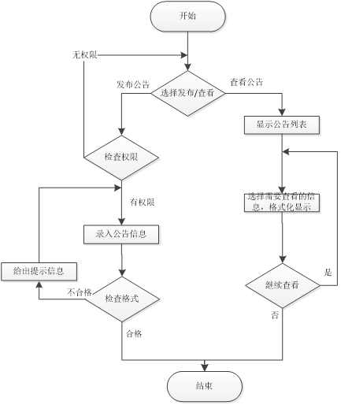

### 留言模块

### 添加图书模块

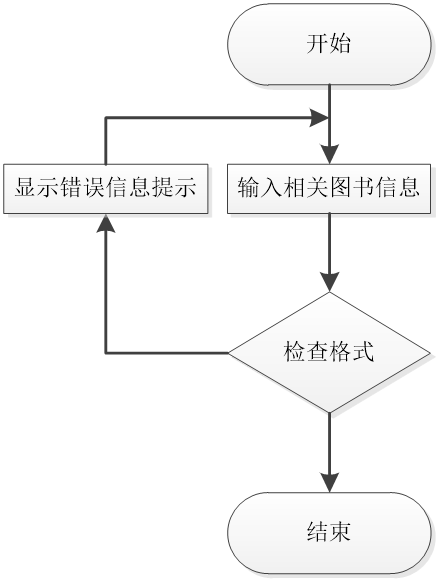

### 查询图书模块

### 登录模块

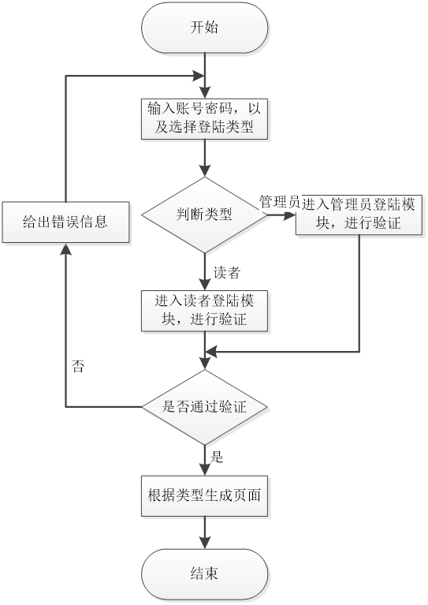

### 新到图书模块

### 通知模块

| 功能     | 描述                             |
| -------- | -------------------------------- |
| 一键催还 | 管理员可以对超期用户进行一键催还 |
| 回复留言 | 回复给用户                       |

### 预约登记模块

| 功能      | 描述                             |
| --------- | -------------------------------- |
| 读者登记  | 读者可以在查询页登记查询到的图书 |
| 查看登记  | 管理员可以查看登记表，发放确认   |
| 导出excel | 将登记表导出为excel              |

### 流通模块

| 功能         | 描述                   |
| ------------ | ---------------------- |
| 查看流通信息 | 管理员可以查看流通信息 |
| 导出excel    | 将登记表导出为excel    |

### 个人中心模块

| 功能         | 描述                       |
| ------------ | -------------------------- |
| 查看通知     | 读者可以查看自己的通知     |
| 查看预约信息 | 读者可以查看自己的预约书目 |
| 查看在借书目 | 读者可以查看自己的在借书目 |

## Acknowledgement

本项目前端使用了开源项目 [vue-element-admin](https://github.com/PanJiaChen/vue-element-admin) , 在此表示感谢👏

